# Notification Service — Implementation

How realtime notifications work in `apps/be`, from the moment a service changes data to the moment a browser shows the bell badge.

**Stack:** NestJS · `@nestjs/event-emitter` (in-process events) · Postgres via TypeORM (storage) · Socket.IO via `@nestjs/websockets` (WebSocket transport) · `@socket.io/redis-adapter` + `ioredis` (fan-out across instances).

> Diagrams use [Mermaid](https://mermaid.js.org/). GitHub and the VS Code Markdown preview render them. Method names below match the source; open the listed file to see each step.

---

## Contents

1. [Big picture](#1-big-picture)
2. [Startup: what gets wired when the app boots](#2-startup-what-gets-wired-when-the-app-boots)
3. [A client connects](#3-a-client-connects)
4. [Main flow: updating a ticket, step by step](#4-main-flow-updating-a-ticket-step-by-step)
5. [Inside the listener: who gets notified](#5-inside-the-listener-who-gets-notified)
6. [Inside `notify()`](#6-inside-notify)
7. [How Redis delivers across instances](#7-how-redis-delivers-across-instances)
8. [Every event: producer → listener → recipients](#8-every-event-producer--listener--recipients)
9. [Read flow: marking notifications as read](#9-read-flow-marking-notifications-as-read)
10. [Offline and reconnect](#10-offline-and-reconnect)
11. [Failure scenarios](#11-failure-scenarios)
12. [Data model](#12-data-model)
13. [File map](#13-file-map)

---

## 1. Big picture

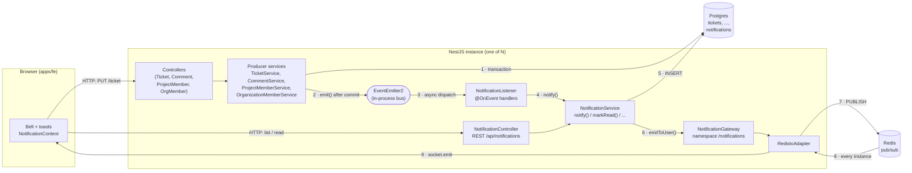

There are **two channels**:

| Channel | Direction | Used for |
|---|---|---|
| **REST** (`/api/notifications…`) | client → server | Loading the list and unread count, marking as read. Goes through the normal guards, validation and interceptors. |
| **WebSocket** (`/notifications` namespace) | server → client only | Pushing new notifications and unread counts as they happen. |

Postgres is the **source of truth**. The socket is only a fast path: anything missed while disconnected is recovered through REST (see [§10](#10-offline-and-reconnect)).

---

## 2. Startup: what gets wired when the app boots

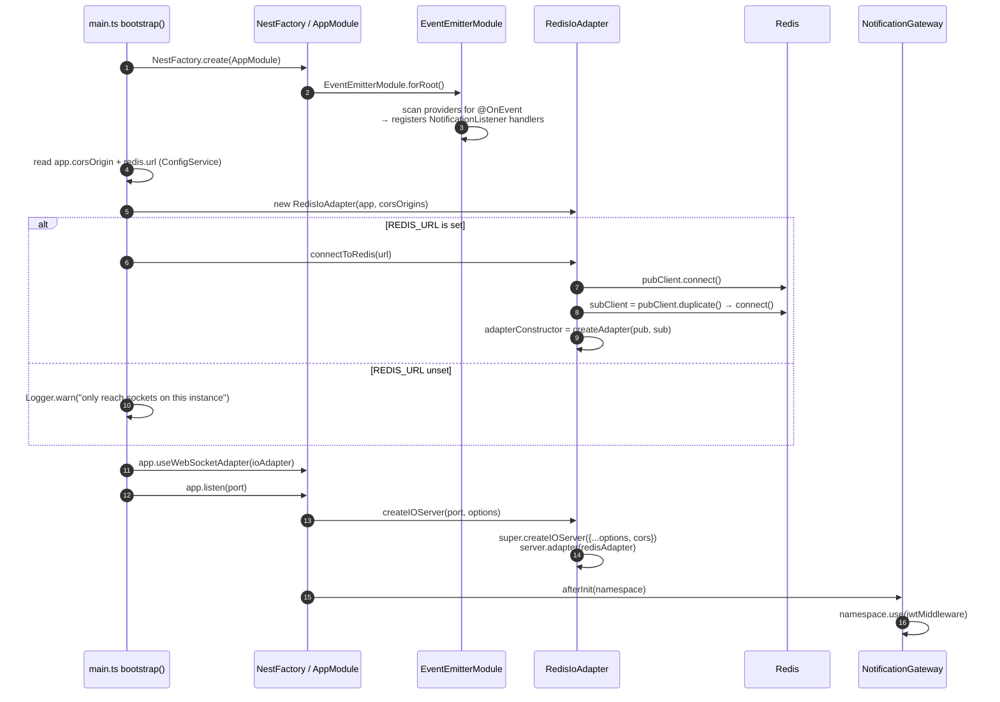

What each step sets up:

1–3. `EventEmitterModule.forRoot()` (in `app.module.ts`) creates one global `EventEmitter2` and **subscribes every `@OnEvent(...)` method** it finds. Here, those are the six handlers on `NotificationListener`.
4–9. `main.ts` builds the `RedisIoAdapter`. It opens **two** Redis connections because a Redis connection in `SUBSCRIBE` mode can't publish, so the adapter needs a publisher and a subscriber.
10–11. Nest now uses this adapter for every `@WebSocketGateway`.
12–14. When the HTTP server starts, Nest asks the adapter for the Socket.IO server. The adapter attaches CORS (the same `CORS_ORIGIN` list as HTTP) and the Redis adapter.
15–16. Nest calls `NotificationGateway.afterInit()`, which installs the **JWT handshake middleware** on the `/notifications` namespace.

---

## 3. A client connects

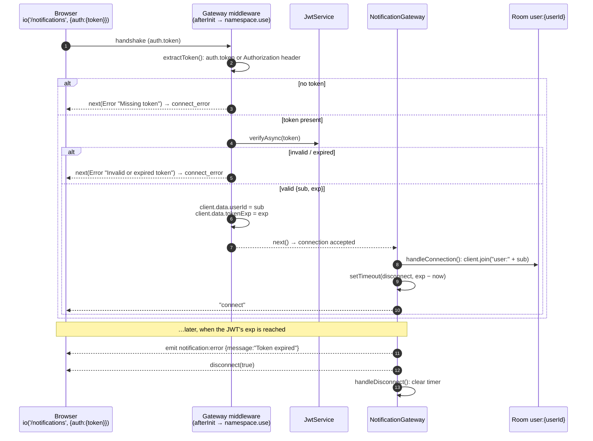

Key points:

- **Auth happens before the connection exists.** A bad token never reaches `handleConnection`, and the browser gets a standard `connect_error`.
- Each user has **one room**, `user:<userId>`. Every tab and device of that user joins it, so one emit reaches all of them.
- The socket is **closed when the token expires**, at the same moment REST calls would start returning 401.
- The global HTTP `AuthGuard` isn't involved here. Guards only run for message handlers, and this gateway has none because it's push-only.

---

## 4. Main flow: updating a ticket, step by step

**Scenario:** Alice reassigns ticket *"Fix login"* to Bob and moves it `TODO → IN_PROGRESS`. Alice's request is handled by **instance A**; Bob's browser is connected to **instance B**.

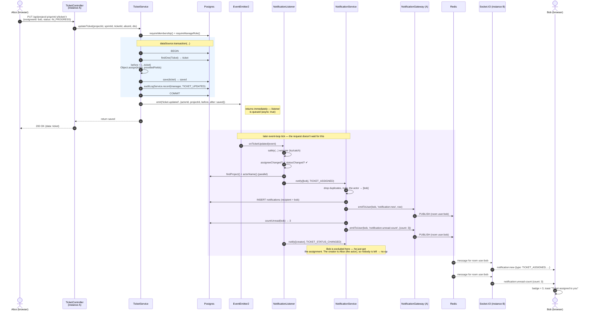

### The same flow as a numbered list

The diagram numbers every arrow; this table groups them into the steps that matter.

| # | Where | What happens | Sync / async |
|---|---|---|---|
| 1 | `TicketController.updateTicket` | Receives the PUT, passes the caller id (`@CurrentUser().sub`) and body to the service. | sync (request) |
| 2 | `TicketService.updateTicket` | `requireMembership()` and `requireManageRole()`: caller must be LEAD or CONTRIBUTOR on the project, else 403. | sync |
| 3 | `TicketService.updateTicket` | Keeps only the fields actually sent (`providedFields`), so omitted fields aren't wiped. | sync |
| 4 | `dataSource.transaction(...)` | `BEGIN` → load the ticket (404 if not in this sprint) → snapshot `before` → apply changes → `save` → write the audit log row with the same `manager` → `COMMIT`. Returns `{ before, saved }`. | sync, one DB transaction |
| 5 | `this.eventEmitter.emit(NotificationEvents.TICKET_UPDATED, …)` | Runs **only if step 4 committed**. If anything threw, we never get here, so nothing is announced. The payload is type-checked against `TicketUpdatedEvent` with `satisfies`. | returns immediately |
| 6 | `TicketService` → controller | Returns `saved`; `ResponseInterceptor` wraps it; Alice gets `200`. The request doesn't wait for steps 7–15. | sync |
| 7 | `EventEmitter2` | Because the handler is registered with `{ async: true }`, EventEmitter2 schedules it for a later event-loop tick instead of calling it inline. | async |
| 8 | `NotificationListener.onTicketUpdated` | Everything inside is wrapped in `safely()`: any error is logged and swallowed, so it can't crash the process or affect the request. | async |
| 9 | `onTicketUpdated` | Works out what changed: `assigneeChanged = after.assigneeId && after.assigneeId !== before.assigneeId`; `statusChanged = after.status !== before.status`. Neither → return (a title-only edit notifies nobody). | async |
| 10 | `findProject()` + `actorName()` | Two small SELECTs in parallel: the project's name and organizationId, and the actor's display name (for "Alice Rahman assigned you…"). | async, DB |
| 11 | `notificationService.notify([assignee], TICKET_ASSIGNED)` | See [§6](#6-inside-notify). | async |
| 12 | `notify()` | Saves the row, then `gateway.emitToUser(bob, 'notification:new', row)`. | async, DB |
| 13 | `notify()` → `pushUnreadCount(bob)` | `COUNT(*) WHERE recipient_id = bob AND read_at IS NULL` (uses the partial index), then `emitToUser(bob, 'notification:unread-count', {count})`. | async, DB |
| 14 | `NotificationGateway.emitToUser` | `this.server.to('user:bob').emit(...)`. The Redis adapter delivers to local sockets **and** publishes to Redis ([§7](#7-how-redis-delivers-across-instances)). | async |
| 15 | `onTicketUpdated` (status part) | Recipients = creator + assignee, **minus the new assignee** (already notified in step 11). `notify()` then drops the actor. Here the creator *is* Alice, so the list is empty and nothing is written. | async |
| 16 | Instance B | Receives the Redis message, finds Bob's socket in room `user:bob`, sends `notification:new` then `notification:unread-count`. | async |
| 17 | Browser | `NotificationContext` adds the item to the list, shows a toast, updates the badge, and tells subscribed pages (the sprint page refetches its tickets). | client |

### Why step 5 comes *after* the transaction

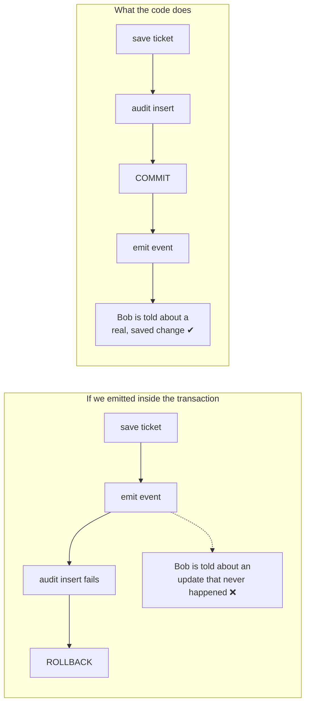

The **audit log** works the opposite way on purpose: it's written *inside* the transaction (`auditLogService.record(manager, …)`) because the audit row must commit or roll back together with the change itself.

---

## 5. Inside the listener: who gets notified

`onTicketUpdated` decision tree:

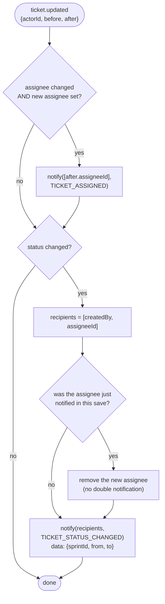

Every handler follows the same shape:

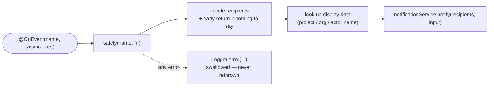

---

## 6. Inside `notify()`

`NotificationService.notify(recipientIds, input)`:

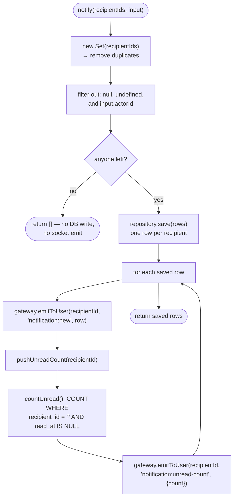

Rules enforced here, for every notification type:

- The **actor is never notified** about their own action.
- A user listed twice (e.g. they're both creator and assignee) gets **one** notification.
- The row is **saved before it's pushed**, so a pushed notification can always be fetched and marked read later.

---

## 7. How Redis delivers across instances

`emitToUser()` doesn't know or care which instance holds the socket:

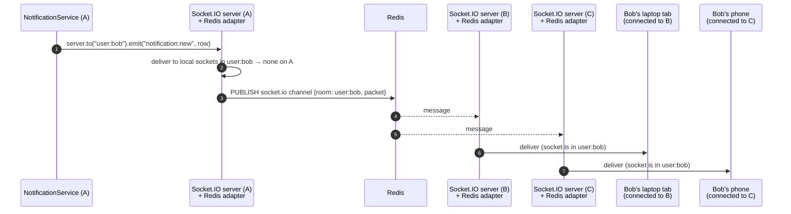

- Every instance subscribes to the same Redis channel at startup ([§2](#2-startup-what-gets-wired-when-the-app-boots)).
- Each instance only delivers to **its own** sockets in the room, so there are no duplicates.
- **Without `REDIS_URL`**, step 3 doesn't exist: only sockets on instance A would get the push. That's fine for a single instance, but broken behind a load balancer.

---

## 8. Every event: producer → listener → recipients

| Trigger (HTTP) | Producer method | Event name | Listener handler | Notification `type` | Recipients (actor always excluded) |
|---|---|---|---|---|---|
| `PUT .../ticket/:ticketId` | `TicketService.updateTicket` | `ticket.updated` | `onTicketUpdated` | `TICKET_ASSIGNED` | new assignee |
| 〃 | 〃 | 〃 | 〃 | `TICKET_STATUS_CHANGED` | creator + assignee (minus a just-assigned user) |
| `POST .../ticket/:ticketId/comment` | `CommentService.createComment` | `comment.created` | `onCommentCreated` | `TICKET_COMMENTED` | ticket creator + assignee |
| `POST /api/project/:projectId/member` | `ProjectMemberService.addProjectMember` | `project.member.added` | `onProjectMemberAdded` | `PROJECT_MEMBER_ADDED` | the added user |
| `DELETE /api/project/:projectId/member/:userId` | `ProjectMemberService.removeProjectMember` | `project.member.removed` | `onProjectMemberRemoved` | `PROJECT_MEMBER_REMOVED` | the removed user |
| `PATCH /api/project/:projectId/member/:userId` | `ProjectMemberService.updateProjectMemberRole` | `project.member.role_updated` | `onProjectMemberRoleUpdated` | `PROJECT_ROLE_CHANGED` | that user (skipped if the role didn't change) |
| `POST /api/organizations/:organizationId/members` | `OrganizationMemberService.createOrganizationMember` | `organization.member.added` | `onOrganizationMemberAdded` | `ORGANIZATION_MEMBER_ADDED` | the added user |

Not notified: ticket **creation** (the creator is the first assignee), ticket deletion, sprint and project changes, comment edits/deletes, organization removals.

The payload types for every event live in `notifications/events/notification.events.ts`.

### Adding a new notification

1. Add the value to `NotificationType` (`enum/notification-type.enum.ts`) **and** write a migration that adds it to the Postgres enum `notifications_type_enum`.
2. Add an event name + payload interface to `events/notification.events.ts`.
3. In the producer service, inject `EventEmitter2` and `emit(...)` **after** the transaction/save succeeds, using `satisfies YourEvent`.
4. Add an `@OnEvent(name, { async: true })` handler to `NotificationListener`, wrapped in `safely()`, that calls `notificationService.notify(...)`.
5. Frontend: add the type to `types/notification.ts`, a color in `NOTIFICATION_TONE`, and a link rule in `notificationLink()` if needed.

---

## 9. Read flow: marking notifications as read

Reads go through REST. The server then pushes the new count to **every** open tab, including other devices:

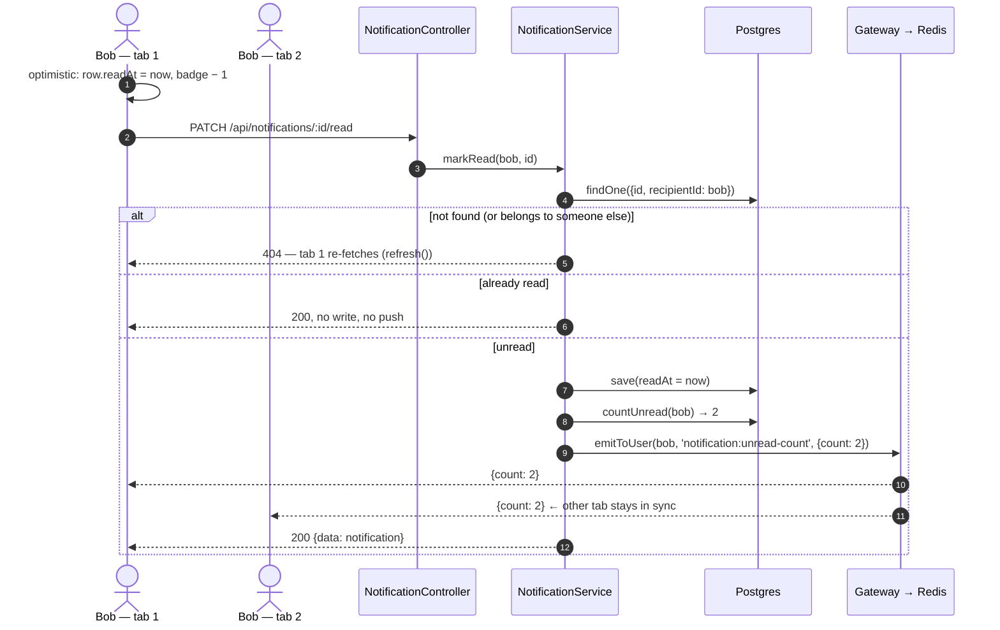

`PATCH /api/notifications/read-all` works the same way: one `UPDATE … WHERE recipient_id = ? AND read_at IS NULL`, then it pushes `{count: 0}`.

Every query is filtered by `recipientId = caller`, so there's no way to read or change another user's notifications.

---

## 10. Offline and reconnect

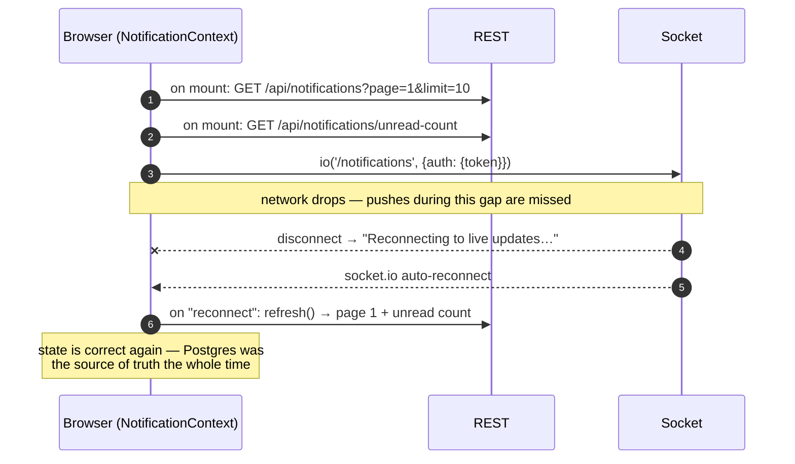

A user who is fully **offline** (no tab open) loses nothing: the rows are in Postgres and load the next time they open the app.

---

## 11. Failure scenarios

| What fails | When | Effect | Is the change saved? | Is the notification kept? |
|---|---|---|---|---|
| Validation or permission (400/403/404) | before the transaction | Request fails normally | no | no event emitted |
| Anything inside the transaction | step 4 | ROLLBACK, request fails | no | no event emitted |
| Listener's DB lookup / INSERT throws | step 10–12 | `safely()` logs the error | **yes** | **lost** |
| Process crashes after COMMIT, before the listener runs | between steps 5 and 8 | — | **yes** | **lost** (events are in memory) |
| Redis down at startup | bootstrap | `connectToRedis()` rejects → app doesn't start | — | — |
| Redis drops while running | step 14 | ioredis logs errors and reconnects on its own; cross-instance pushes are missed meanwhile | yes | **yes** (row saved) — shows on next refresh |
| Recipient offline / socket disconnected | step 16 | nothing delivered live | yes | yes — loaded via REST later |
| JWT expires | any time | server sends `notification:error` and disconnects | — | — |

**Delivery isn't guaranteed.** The two "lost" rows above are the tradeoff of in-memory events. If that's ever unacceptable, the upgrade is a **transactional outbox**: write an `outbox` row inside the same transaction as the change, and let a worker (e.g. BullMQ on the existing Redis) turn it into notifications, with retries.

---

## 12. Data model

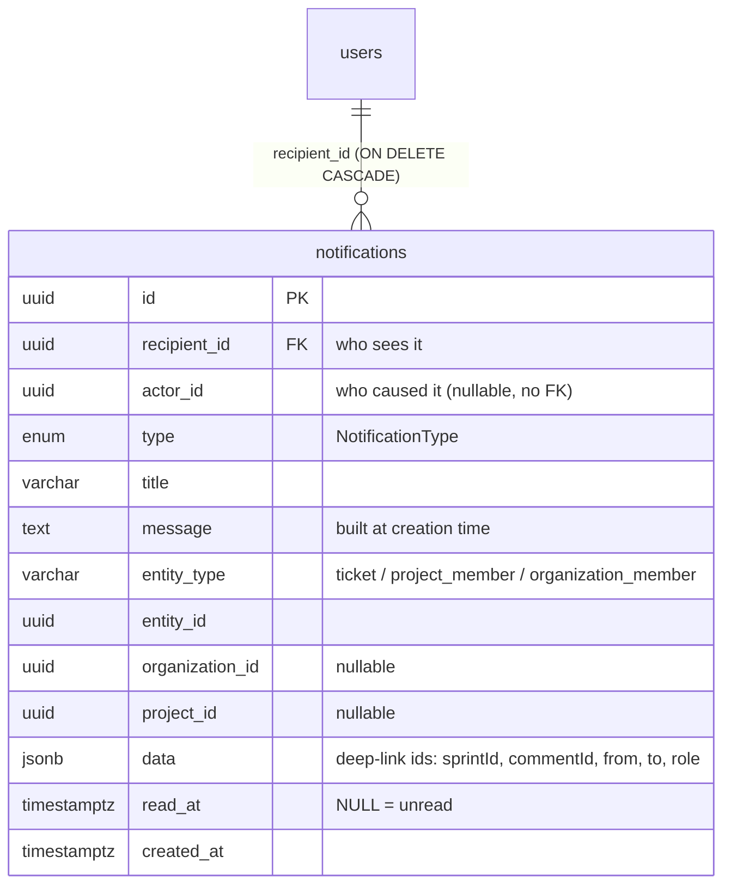

| Index | Columns | Serves |
|---|---|---|
| `IDX_notifications_recipient` | `(recipient_id, created_at)` | `GET /api/notifications`: filter by user, newest first, paginated |
| `IDX_notifications_recipient_unread` | `(recipient_id) WHERE read_at IS NULL` | unread count, `?unread=true`, read-all. A **partial** index only covers unread rows, so it stays small. |

Notes:
- `title`/`message` are stored as text, not rebuilt from live data. Renaming a ticket later doesn't change old notifications, which keeps them an accurate history.
- Deleting a user deletes their notifications (`CASCADE`). `actor_id` has no FK, so a deleted actor leaves the row intact.
- Migration: `src/migrations/1790680000000-AddNotificationTable.ts`.

---

## 13. File map

```
apps/be/src/
├─ main.ts                                   RedisIoAdapter setup, useWebSocketAdapter()
├─ app.module.ts                             EventEmitterModule.forRoot(), NotificationsModule, redisConfig
├─ config/redis.config.ts                    REDIS_URL
├─ common/adapters/redis-io.adapter.ts       Socket.IO ⇄ Redis pub/sub, CORS
├─ migrations/1790680000000-AddNotificationTable.ts
│
├─ modules/notifications/
│  ├─ notifications.module.ts                wires controller, service, gateway, listener
│  ├─ events/notification.events.ts          event names + payload types (the contract)
│  ├─ listener/notification.listener.ts      @OnEvent handlers — who gets what
│  ├─ service/notification.service.ts        notify(), findAll(), countUnread(), markRead(), markAllRead()
│  ├─ gateway/notification.gateway.ts        /notifications namespace, JWT handshake, rooms, expiry
│  ├─ controller/notification.controller.ts  REST endpoints
│  ├─ dto/filter-notification.dto.ts         ?unread, ?page, ?limit
│  ├─ entity/notification.entity.ts          table + indexes
│  ├─ enum/notification-type.enum.ts
│  ├─ listener/notification.listener.spec.ts recipient rules
│  └─ service/notification.service.spec.ts   dedupe, actor exclusion, ownership, pushes
│
└─ modules/ (producers — emit only, never import the notifications module)
   ├─ tickets/service/ticket.service.ts                    ticket.updated
   ├─ comments/service/comment.service.ts                  comment.created
   ├─ project_members/service/project-member.service.ts    project.member.added / removed / role_updated
   └─ organization_members/service/organization_member.service.ts  organization.member.added
```

**Dependency direction:** producers → `EventEmitter2` ← `NotificationListener` → `NotificationService` → `NotificationGateway` → `RedisIoAdapter`. Nothing in the notifications module is imported by feature modules, apart from the event-name constants and payload types.

**Setup and API reference:** see the "Realtime notifications" section in [`API_GUIDE.md`](./API_GUIDE.md).
